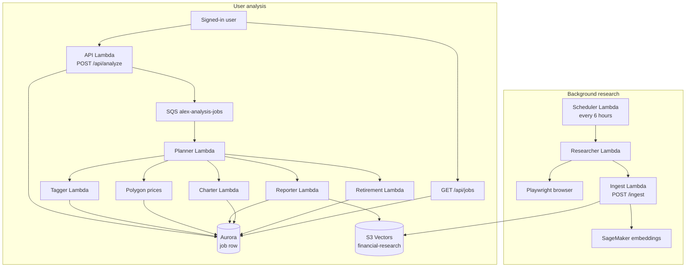
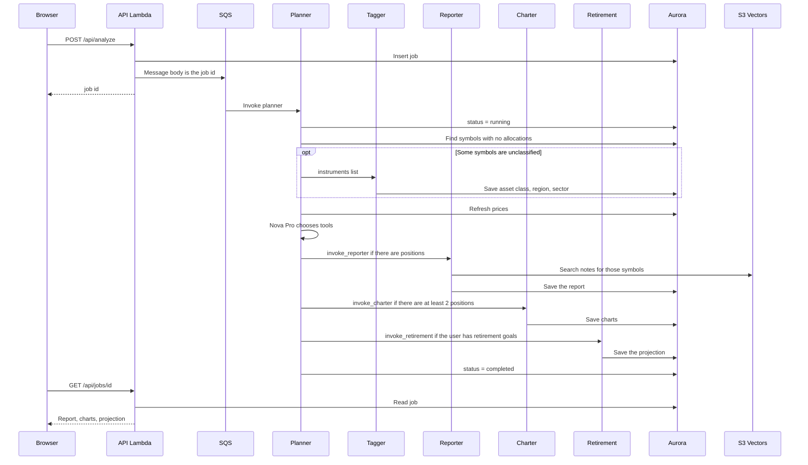
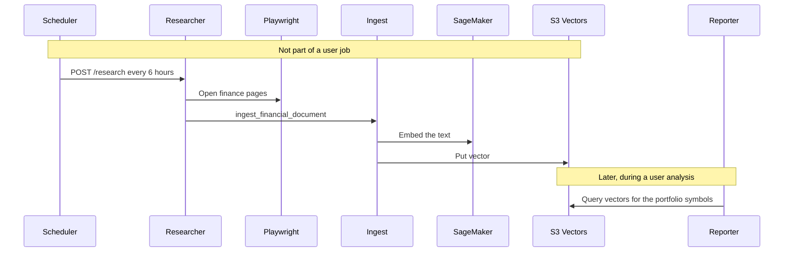

# How the agents work together

Alex has six agents. Five of them run when a user asks for a portfolio analysis. The researcher runs on its own schedule and never talks to the planner. They share two stores: Aurora (portfolios, jobs, reports) and S3 Vectors (market write-ups).

Every agent that calls a model uses Bedrock **Nova Pro** through LiteLLM (`BEDROCK_MODEL_ID`, for this deployment `eu.amazon.nova-pro-v1:0`).

## The two loops

The analysis loop is request/response through SQS, so the browser does not wait for the whole run. The API creates a job, returns the job id, and the frontend polls `/api/jobs`. The research loop fills the knowledge base that the reporter searches later.

## What each agent does

| Agent | Lambda | Who starts it | What it does | What it writes |
| --- | --- | --- | --- | --- |
| Planner | `alex-planner` | SQS | Decides which specialists to call | Job status: `running`, `completed`, or `failed` |
| Tagger | `alex-tagger` | Planner, before the planner model runs | Classifies a symbol that has no allocations yet | Instrument rows in Aurora |
| Reporter | `alex-reporter` | Planner tool `invoke_reporter` | Writes the portfolio narrative | Report on the job, after reading S3 Vectors |
| Charter | `alex-charter` | Planner tool `invoke_charter` | Builds chart JSON for the UI | Chart payload on the job |
| Retirement | `alex-retirement` | Planner tool `invoke_retirement` | Projects retirement income | Projection payload on the job |
| Researcher | `alex-researcher` | Scheduler, or `POST /research` | Browses the web and writes a market note | Calls ingest, which stores a vector |

Ingest is not an agent. It embeds text with SageMaker (`all-MiniLM-L6-v2`, 384 dimensions) and stores it in the `financial-research` index. The researcher is the only agent that calls it.

## One analysis, step by step

Tagger is not a tool the planner model can call. The handler runs it in code first, and only when a held symbol has no allocation data. After that, the planner model is allowed only three tools: `invoke_reporter`, `invoke_charter`, and `invoke_retirement`. Each tool is a synchronous `lambda:Invoke` of that function. The instructions tell the model to call them in that order, then answer "Done".

If Nova Pro rate-limits the planner, the handler retries with backoff. A failure marks the job `failed` and the message can land on the dead-letter queue after three receives.

## How the researcher stays separate

The planner never invokes the researcher. The reporter is the agent that reads what the researcher stored. That is why an analysis can still finish when the researcher has not run yet: the reporter simply has less market context.

The scheduler is off unless the SAM parameter `SchedulerEnabled` is `true`. A person can still start one research run with `POST /research`.
